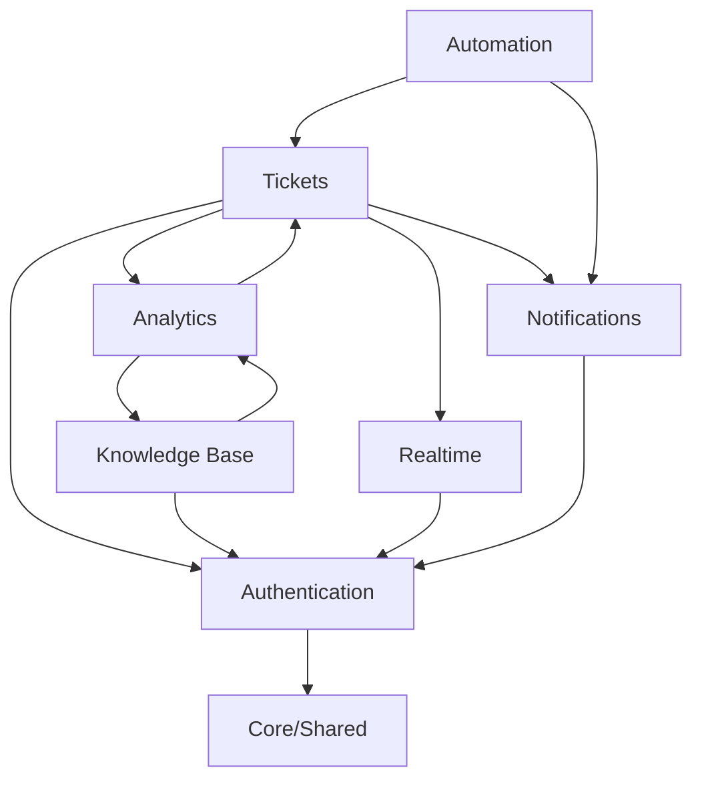

# Modules Overview

> Implementation guides for each major system component

---

## Module Directory

This section contains detailed implementation documentation for each InsightDesk module:

| Module | Description | Status |
|--------|-------------|--------|
| [Authentication](./auth/overview.md) | User auth, sessions, permissions | 🔨 |
| [Tickets](./tickets/overview.md) | Ticket management system | 🔨 |
| [Real-time](./realtime/overview.md) | WebSocket & live features | 🔨 |
| [Knowledge Base](./knowledge-base/overview.md) | Self-service articles | 🔨 |
| [Automation](./automation/overview.md) | Workflows & triggers | 🔨 |
| [Notifications](./notifications/overview.md) | Multi-channel notifications | 🔨 |
| [Analytics](./analytics/overview.md) | Reporting & dashboards | 🔨 |

---

## Module Architecture

Each module follows a consistent structure:

```
modules/
├── [module-name]/
│   ├── controllers/       # API route handlers
│   │   └── *.controller.ts
│   ├── services/          # Business logic
│   │   └── *.service.ts
│   ├── repositories/      # Data access layer
│   │   └── *.repository.ts
│   ├── validators/        # Request validation
│   │   └── *.validator.ts
│   ├── events/            # Event emitters
│   │   └── *.events.ts
│   ├── jobs/              # Background jobs
│   │   └── *.job.ts
│   ├── types/             # TypeScript types
│   │   └── *.types.ts
│   ├── utils/             # Module utilities
│   │   └── *.util.ts
│   ├── tests/             # Module tests
│   │   ├── unit/
│   │   └── integration/
│   └── index.ts           # Module exports
```

---

## Module Dependencies



---

## Shared Services

All modules have access to these shared services:

| Service | Purpose | Location |
|---------|---------|----------|
| `Logger` | Structured logging | `@/shared/logger` |
| `Cache` | Valkey caching | `@/shared/cache` |
| `Queue` | BullMQ job queue | `@/shared/queue` |
| `Events` | Event emitter | `@/shared/events` |
| `Database` | Prisma client | `@/shared/database` |
| `Validator` | Zod schemas | `@/shared/validator` |
| `Error` | Error classes | `@/shared/errors` |

---

## Module Communication

### Event-Driven

Modules communicate via events:

```typescript
// tickets module emits event
eventEmitter.emit('ticket:created', {
  ticket,
  createdBy: user.id
});

// automation module listens
eventEmitter.on('ticket:created', async (payload) => {
  await automationService.processRules('ticket.created', payload);
});

// notifications module listens
eventEmitter.on('ticket:created', async (payload) => {
  await notificationService.notify('ticket:new', payload);
});
```

### Direct Service Calls

For synchronous operations:

```typescript
// In tickets controller
const canAccess = await authService.checkPermission(
  user.id,
  'ticket:read',
  ticket.id
);

// In automation service
const ticket = await ticketService.update(ticketId, changes);
```

---

## Module Registration

Modules are registered in the application bootstrap:

```typescript
// src/app.ts
import { AuthModule } from '@/modules/auth';
import { TicketsModule } from '@/modules/tickets';
import { RealtimeModule } from '@/modules/realtime';
import { KnowledgeBaseModule } from '@/modules/knowledge-base';
import { AutomationModule } from '@/modules/automation';
import { NotificationsModule } from '@/modules/notifications';
import { AnalyticsModule } from '@/modules/analytics';

export async function createApp() {
  const app = express();
  
  // Core middleware
  app.use(cors(corsConfig));
  app.use(helmet(helmetConfig));
  app.use(express.json());
  
  // Register modules
  app.use('/api/v1/auth', AuthModule.routes);
  app.use('/api/v1/tickets', TicketsModule.routes);
  app.use('/api/v1/kb', KnowledgeBaseModule.routes);
  app.use('/api/v1/admin/automations', AutomationModule.routes);
  app.use('/api/v1/notifications', NotificationsModule.routes);
  app.use('/api/v1/analytics', AnalyticsModule.routes);
  
  // Initialize modules
  await RealtimeModule.initialize(server);
  await AutomationModule.startScheduler();
  await NotificationsModule.startWorkers();
  
  return app;
}
```

---

## Next Steps

- [Authentication Module →](./auth/overview.md)
- [Tickets Module →](./tickets/overview.md)
- [Real-time Module →](./realtime/overview.md)

---

*Back to: [Documentation Index](../README.md)*
