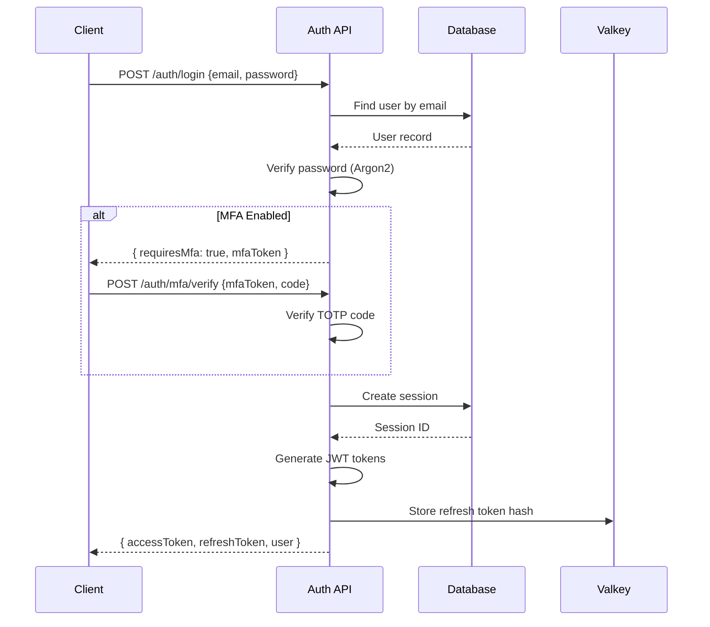
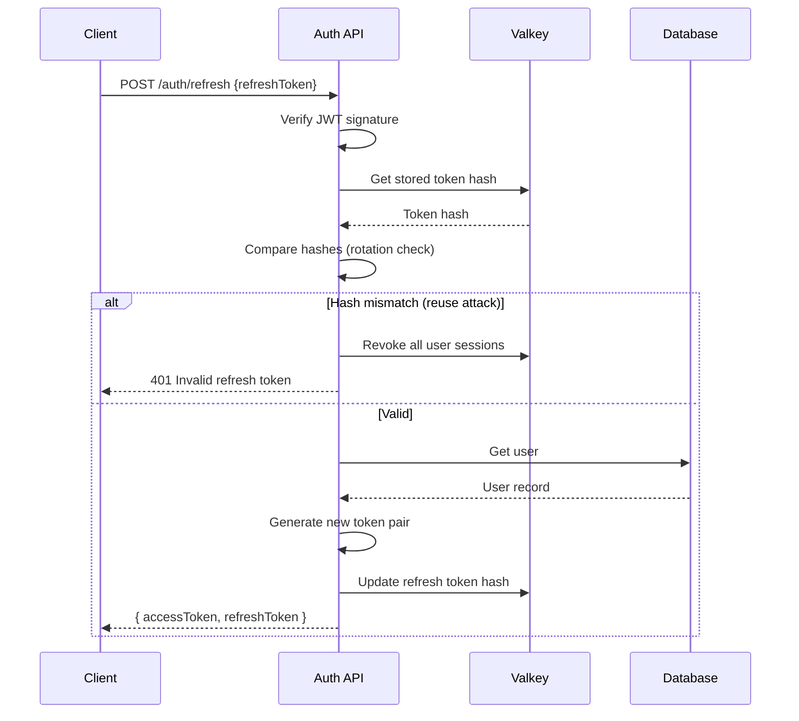

# Authentication Module

> User authentication, session management, and authorization implementation

---

## Table of Contents

- [Overview](#overview)
- [Directory Structure](#directory-structure)
- [Components](#components)
- [Authentication Flow](#authentication-flow)
- [Session Management](#session-management)
- [Password Security](#password-security)
- [Multi-Factor Authentication](#multi-factor-authentication)
- [OAuth Integration](#oauth-integration)
- [Implementation Guide](#implementation-guide)

---

## Overview

The Authentication module handles:

- User registration and login
- JWT access and refresh tokens
- Session management with refresh token rotation
- Password hashing and verification
- Multi-factor authentication (TOTP)
- OAuth 2.0 social login
- Permission and role-based access control

---

## Directory Structure

```
modules/auth/
├── controllers/
│   ├── auth.controller.ts       # Login, register, logout
│   ├── password.controller.ts   # Password reset flow
│   ├── mfa.controller.ts        # MFA setup and verify
│   └── oauth.controller.ts      # OAuth callbacks
├── services/
│   ├── auth.service.ts          # Core auth logic
│   ├── token.service.ts         # JWT handling
│   ├── session.service.ts       # Session management
│   ├── password.service.ts      # Password operations
│   ├── mfa.service.ts           # TOTP/WebAuthn
│   └── oauth.service.ts         # OAuth providers
├── middleware/
│   ├── authenticate.ts          # Auth middleware
│   ├── authorize.ts             # RBAC middleware
│   └── rate-limit.ts            # Auth rate limiting
├── repositories/
│   ├── user.repository.ts       # User data access
│   ├── session.repository.ts    # Session storage
│   └── token.repository.ts      # Token blacklist
├── validators/
│   ├── auth.validator.ts        # Login/register schemas
│   └── password.validator.ts    # Password schemas
├── types/
│   ├── auth.types.ts            # Auth interfaces
│   └── jwt.types.ts             # Token types
├── events/
│   └── auth.events.ts           # Auth event emitters
├── jobs/
│   ├── cleanup-sessions.job.ts  # Session cleanup
│   └── token-blacklist.job.ts   # Token cleanup
├── tests/
│   ├── unit/
│   │   ├── auth.service.test.ts
│   │   └── token.service.test.ts
│   └── integration/
│       └── auth.test.ts
└── index.ts
```

---

## Components

### Auth Service

Core authentication business logic:

```typescript
// services/auth.service.ts
import { hash, verify } from '@node-rs/argon2';
import { UserRepository } from '../repositories/user.repository';
import { TokenService } from './token.service';
import { SessionService } from './session.service';
import { MfaService } from './mfa.service';
import { AuthError, ValidationError } from '@/shared/errors';
import { eventEmitter } from '@/shared/events';

export class AuthService {
  constructor(
    private userRepo: UserRepository,
    private tokenService: TokenService,
    private sessionService: SessionService,
    private mfaService: MfaService
  ) {}

  async register(data: RegisterInput): Promise<AuthResult> {
    // Check if email exists
    const existing = await this.userRepo.findByEmail(data.email);
    if (existing) {
      throw new ValidationError('Email already registered', 'EMAIL_EXISTS');
    }

    // Hash password
    const passwordHash = await hash(data.password, {
      memoryCost: 65536,
      timeCost: 3,
      parallelism: 4,
    });

    // Create user
    const user = await this.userRepo.create({
      email: data.email,
      name: data.name,
      passwordHash,
      role: 'user',
      emailVerified: false,
    });

    // Create session
    const session = await this.sessionService.create(user.id, {
      userAgent: data.userAgent,
      ip: data.ip,
    });

    // Generate tokens
    const tokens = await this.tokenService.generateTokenPair(user, session.id);

    // Emit event
    eventEmitter.emit('user:registered', { user });

    // Send verification email (async)
    this.sendVerificationEmail(user);

    return {
      user: this.sanitizeUser(user),
      ...tokens,
    };
  }

  async login(data: LoginInput): Promise<AuthResult> {
    // Find user
    const user = await this.userRepo.findByEmail(data.email);
    if (!user) {
      throw new AuthError('Invalid credentials', 'INVALID_CREDENTIALS');
    }

    // Check if locked
    if (user.lockedUntil && user.lockedUntil > new Date()) {
      throw new AuthError('Account locked', 'ACCOUNT_LOCKED');
    }

    // Verify password
    const validPassword = await verify(user.passwordHash, data.password);
    if (!validPassword) {
      await this.handleFailedLogin(user);
      throw new AuthError('Invalid credentials', 'INVALID_CREDENTIALS');
    }

    // Reset failed attempts
    if (user.failedLoginAttempts > 0) {
      await this.userRepo.update(user.id, {
        failedLoginAttempts: 0,
        lockedUntil: null,
      });
    }

    // Check MFA
    if (user.mfaEnabled) {
      if (!data.mfaCode) {
        return {
          requiresMfa: true,
          mfaToken: await this.mfaService.generateMfaToken(user.id),
        };
      }

      const validMfa = await this.mfaService.verifyCode(user.id, data.mfaCode);
      if (!validMfa) {
        throw new AuthError('Invalid MFA code', 'INVALID_MFA');
      }
    }

    // Create session
    const session = await this.sessionService.create(user.id, {
      userAgent: data.userAgent,
      ip: data.ip,
    });

    // Generate tokens
    const tokens = await this.tokenService.generateTokenPair(user, session.id);

    // Emit event
    eventEmitter.emit('user:login', { user, ip: data.ip });

    return {
      user: this.sanitizeUser(user),
      ...tokens,
    };
  }

  async logout(userId: string, sessionId: string): Promise<void> {
    // Revoke session
    await this.sessionService.revoke(sessionId);
    
    // Emit event
    eventEmitter.emit('user:logout', { userId, sessionId });
  }

  async logoutAll(userId: string): Promise<void> {
    // Revoke all sessions
    await this.sessionService.revokeAll(userId);
    
    // Emit event
    eventEmitter.emit('user:logout:all', { userId });
  }

  private async handleFailedLogin(user: User): Promise<void> {
    const attempts = user.failedLoginAttempts + 1;
    const maxAttempts = 5;
    const lockoutMinutes = 15;

    const update: Partial<User> = {
      failedLoginAttempts: attempts,
    };

    if (attempts >= maxAttempts) {
      update.lockedUntil = new Date(Date.now() + lockoutMinutes * 60 * 1000);
      eventEmitter.emit('user:locked', { user, attempts });
    }

    await this.userRepo.update(user.id, update);
  }

  private sanitizeUser(user: User): PublicUser {
    const { passwordHash, mfaSecret, ...safe } = user;
    return safe;
  }
}
```

### Token Service

JWT token generation and validation:

```typescript
// services/token.service.ts
import jwt from 'jsonwebtoken';
import { Redis } from 'ioredis';
import { config } from '@/config';

export class TokenService {
  private readonly accessTokenExpiry = '15m';
  private readonly refreshTokenExpiry = '7d';

  constructor(private redis: Redis) {}

  async generateTokenPair(
    user: User,
    sessionId: string
  ): Promise<TokenPair> {
    const accessToken = this.generateAccessToken(user, sessionId);
    const refreshToken = await this.generateRefreshToken(user.id, sessionId);

    return {
      accessToken,
      refreshToken,
      expiresIn: 900, // 15 minutes in seconds
    };
  }

  private generateAccessToken(user: User, sessionId: string): string {
    return jwt.sign(
      {
        sub: user.id,
        email: user.email,
        role: user.role,
        sessionId,
      },
      config.jwt.accessSecret,
      {
        expiresIn: this.accessTokenExpiry,
        issuer: 'insightdesk',
        audience: 'insightdesk-api',
      }
    );
  }

  private async generateRefreshToken(
    userId: string,
    sessionId: string
  ): Promise<string> {
    const token = jwt.sign(
      {
        sub: userId,
        sessionId,
        type: 'refresh',
      },
      config.jwt.refreshSecret,
      { expiresIn: this.refreshTokenExpiry }
    );

    // Store token hash in Redis for validation
    const tokenHash = this.hashToken(token);
    await this.redis.setex(
      `refresh:${sessionId}`,
      7 * 24 * 60 * 60, // 7 days
      tokenHash
    );

    return token;
  }

  async verifyAccessToken(token: string): Promise<AccessTokenPayload> {
    try {
      const payload = jwt.verify(token, config.jwt.accessSecret, {
        issuer: 'insightdesk',
        audience: 'insightdesk-api',
      }) as AccessTokenPayload;

      // Check if token is blacklisted
      const isBlacklisted = await this.isTokenBlacklisted(token);
      if (isBlacklisted) {
        throw new Error('Token revoked');
      }

      return payload;
    } catch (error) {
      if (error instanceof jwt.TokenExpiredError) {
        throw new AuthError('Token expired', 'TOKEN_EXPIRED');
      }
      throw new AuthError('Invalid token', 'TOKEN_INVALID');
    }
  }

  async refreshTokens(refreshToken: string): Promise<TokenPair> {
    // Verify refresh token
    const payload = jwt.verify(
      refreshToken,
      config.jwt.refreshSecret
    ) as RefreshTokenPayload;

    // Validate against stored hash (rotation)
    const storedHash = await this.redis.get(`refresh:${payload.sessionId}`);
    const tokenHash = this.hashToken(refreshToken);

    if (!storedHash || storedHash !== tokenHash) {
      // Possible token reuse attack - revoke all sessions
      await this.revokeAllUserTokens(payload.sub);
      throw new AuthError('Invalid refresh token', 'REFRESH_INVALID');
    }

    // Get user
    const user = await this.userRepo.findById(payload.sub);
    if (!user) {
      throw new AuthError('User not found', 'USER_NOT_FOUND');
    }

    // Generate new token pair (rotation)
    return this.generateTokenPair(user, payload.sessionId);
  }

  async revokeToken(token: string): Promise<void> {
    const payload = jwt.decode(token) as AccessTokenPayload;
    if (!payload) return;

    // Add to blacklist until expiry
    const ttl = payload.exp - Math.floor(Date.now() / 1000);
    if (ttl > 0) {
      await this.redis.setex(
        `blacklist:${this.hashToken(token)}`,
        ttl,
        '1'
      );
    }
  }

  private hashToken(token: string): string {
    return crypto.createHash('sha256').update(token).digest('hex');
  }

  private async isTokenBlacklisted(token: string): Promise<boolean> {
    const exists = await this.redis.exists(
      `blacklist:${this.hashToken(token)}`
    );
    return exists === 1;
  }
}
```

### Auth Middleware

Request authentication:

```typescript
// middleware/authenticate.ts
import { Request, Response, NextFunction } from 'express';
import { TokenService } from '../services/token.service';
import { AuthError } from '@/shared/errors';

export function authenticate(tokenService: TokenService) {
  return async (req: Request, res: Response, next: NextFunction) => {
    try {
      // Extract token from header
      const authHeader = req.headers.authorization;
      if (!authHeader?.startsWith('Bearer ')) {
        throw new AuthError('Missing authorization token', 'TOKEN_MISSING');
      }

      const token = authHeader.substring(7);
      
      // Verify token
      const payload = await tokenService.verifyAccessToken(token);
      
      // Attach user to request
      req.user = {
        id: payload.sub,
        email: payload.email,
        role: payload.role,
        sessionId: payload.sessionId,
      };

      next();
    } catch (error) {
      next(error);
    }
  };
}

// Optional authentication (doesn't fail if no token)
export function optionalAuth(tokenService: TokenService) {
  return async (req: Request, res: Response, next: NextFunction) => {
    const authHeader = req.headers.authorization;
    if (!authHeader?.startsWith('Bearer ')) {
      return next();
    }

    try {
      const token = authHeader.substring(7);
      const payload = await tokenService.verifyAccessToken(token);
      req.user = {
        id: payload.sub,
        email: payload.email,
        role: payload.role,
        sessionId: payload.sessionId,
      };
    } catch {
      // Ignore auth errors for optional auth
    }

    next();
  };
}
```

### Authorization Middleware

Role-based access control:

```typescript
// middleware/authorize.ts
import { Request, Response, NextFunction } from 'express';
import { AuthError } from '@/shared/errors';

type Role = 'user' | 'agent' | 'admin';

const roleHierarchy: Record<Role, number> = {
  user: 1,
  agent: 2,
  admin: 3,
};

export function authorize(...allowedRoles: Role[]) {
  return (req: Request, res: Response, next: NextFunction) => {
    if (!req.user) {
      throw new AuthError('Authentication required', 'AUTH_REQUIRED');
    }

    const userRole = req.user.role as Role;
    const hasPermission = allowedRoles.some(
      (role) => roleHierarchy[userRole] >= roleHierarchy[role]
    );

    if (!hasPermission) {
      throw new AuthError(
        `Required role: ${allowedRoles.join(' or ')}`,
        'INSUFFICIENT_ROLE'
      );
    }

    next();
  };
}

// Resource-based authorization
export function authorizeResource(
  getResourceOwnerId: (req: Request) => Promise<string>
) {
  return async (req: Request, res: Response, next: NextFunction) => {
    if (!req.user) {
      throw new AuthError('Authentication required', 'AUTH_REQUIRED');
    }

    // Admins can access anything
    if (req.user.role === 'admin') {
      return next();
    }

    const ownerId = await getResourceOwnerId(req);
    if (ownerId !== req.user.id) {
      throw new AuthError('Access denied', 'RESOURCE_ACCESS_DENIED');
    }

    next();
  };
}
```

---

## Authentication Flow

### Login Flow Diagram



### Token Refresh Flow



---

## Session Management

### Session Schema

```prisma
model Session {
  id           String    @id @default(cuid())
  userId       String
  user         User      @relation(fields: [userId], references: [id])
  userAgent    String?
  ip           String?
  lastActiveAt DateTime  @default(now())
  expiresAt    DateTime
  revokedAt    DateTime?
  createdAt    DateTime  @default(now())
  
  @@index([userId])
  @@index([expiresAt])
}
```

### Session Service

```typescript
// services/session.service.ts
export class SessionService {
  private readonly sessionTTL = 7 * 24 * 60 * 60 * 1000; // 7 days

  async create(userId: string, metadata: SessionMetadata): Promise<Session> {
    return this.prisma.session.create({
      data: {
        userId,
        userAgent: metadata.userAgent,
        ip: metadata.ip,
        expiresAt: new Date(Date.now() + this.sessionTTL),
      },
    });
  }

  async get(sessionId: string): Promise<Session | null> {
    const session = await this.prisma.session.findUnique({
      where: { id: sessionId },
    });

    if (!session) return null;
    if (session.revokedAt) return null;
    if (session.expiresAt < new Date()) return null;

    return session;
  }

  async touch(sessionId: string): Promise<void> {
    await this.prisma.session.update({
      where: { id: sessionId },
      data: { lastActiveAt: new Date() },
    });
  }

  async revoke(sessionId: string): Promise<void> {
    await this.prisma.session.update({
      where: { id: sessionId },
      data: { revokedAt: new Date() },
    });
  }

  async revokeAll(userId: string): Promise<void> {
    await this.prisma.session.updateMany({
      where: { userId, revokedAt: null },
      data: { revokedAt: new Date() },
    });
  }

  async listActive(userId: string): Promise<Session[]> {
    return this.prisma.session.findMany({
      where: {
        userId,
        revokedAt: null,
        expiresAt: { gt: new Date() },
      },
      orderBy: { lastActiveAt: 'desc' },
    });
  }
}
```

---

## Password Security

### Argon2 Configuration

```typescript
// services/password.service.ts
import { hash, verify } from '@node-rs/argon2';

export class PasswordService {
  // OWASP recommended settings
  private readonly argon2Options = {
    memoryCost: 65536,    // 64 MB
    timeCost: 3,          // 3 iterations
    parallelism: 4,       // 4 threads
  };

  async hash(password: string): Promise<string> {
    return hash(password, this.argon2Options);
  }

  async verify(hash: string, password: string): Promise<boolean> {
    return verify(hash, password);
  }

  validateStrength(password: string): ValidationResult {
    const errors: string[] = [];

    if (password.length < 12) {
      errors.push('Password must be at least 12 characters');
    }
    if (!/[A-Z]/.test(password)) {
      errors.push('Password must contain an uppercase letter');
    }
    if (!/[a-z]/.test(password)) {
      errors.push('Password must contain a lowercase letter');
    }
    if (!/[0-9]/.test(password)) {
      errors.push('Password must contain a number');
    }
    if (!/[^A-Za-z0-9]/.test(password)) {
      errors.push('Password must contain a special character');
    }

    return {
      valid: errors.length === 0,
      errors,
    };
  }
}
```

### Password Reset Flow

```typescript
// services/password.service.ts
export class PasswordService {
  async initiateReset(email: string): Promise<void> {
    const user = await this.userRepo.findByEmail(email);
    
    // Always return success (prevent email enumeration)
    if (!user) return;

    // Generate secure token
    const token = crypto.randomBytes(32).toString('hex');
    const tokenHash = this.hashToken(token);
    const expiresAt = new Date(Date.now() + 60 * 60 * 1000); // 1 hour

    // Store token
    await this.prisma.passwordReset.create({
      data: {
        userId: user.id,
        tokenHash,
        expiresAt,
      },
    });

    // Send email (async)
    await this.emailService.sendPasswordReset(user.email, token);
  }

  async resetPassword(token: string, newPassword: string): Promise<void> {
    const tokenHash = this.hashToken(token);

    // Find valid reset request
    const reset = await this.prisma.passwordReset.findFirst({
      where: {
        tokenHash,
        expiresAt: { gt: new Date() },
        usedAt: null,
      },
      include: { user: true },
    });

    if (!reset) {
      throw new AuthError('Invalid or expired reset token', 'RESET_INVALID');
    }

    // Validate password strength
    const validation = this.validateStrength(newPassword);
    if (!validation.valid) {
      throw new ValidationError('Password too weak', validation.errors);
    }

    // Update password
    const passwordHash = await this.hash(newPassword);
    await this.prisma.$transaction([
      this.prisma.user.update({
        where: { id: reset.userId },
        data: { passwordHash },
      }),
      this.prisma.passwordReset.update({
        where: { id: reset.id },
        data: { usedAt: new Date() },
      }),
      // Revoke all sessions (force re-login)
      this.prisma.session.updateMany({
        where: { userId: reset.userId },
        data: { revokedAt: new Date() },
      }),
    ]);

    // Emit event
    eventEmitter.emit('user:password:changed', { userId: reset.userId });
  }
}
```

---

## Multi-Factor Authentication

### TOTP Implementation

```typescript
// services/mfa.service.ts
import { authenticator } from 'otplib';

export class MfaService {
  async setupMfa(userId: string): Promise<MfaSetupResult> {
    // Generate secret
    const secret = authenticator.generateSecret();
    
    // Store pending secret (not enabled yet)
    await this.prisma.user.update({
      where: { id: userId },
      data: { mfaSecret: secret },
    });

    // Generate QR code URL
    const user = await this.userRepo.findById(userId);
    const otpauthUrl = authenticator.keyuri(
      user.email,
      'InsightDesk',
      secret
    );

    return {
      secret,
      otpauthUrl,
      qrCode: await this.generateQRCode(otpauthUrl),
    };
  }

  async enableMfa(userId: string, code: string): Promise<string[]> {
    const user = await this.userRepo.findById(userId);
    
    if (!user.mfaSecret) {
      throw new AuthError('MFA not set up', 'MFA_NOT_SETUP');
    }

    // Verify code
    const valid = authenticator.verify({
      token: code,
      secret: user.mfaSecret,
    });

    if (!valid) {
      throw new AuthError('Invalid MFA code', 'INVALID_MFA');
    }

    // Generate backup codes
    const backupCodes = this.generateBackupCodes();
    const hashedCodes = await Promise.all(
      backupCodes.map((code) => this.hashBackupCode(code))
    );

    // Enable MFA
    await this.prisma.user.update({
      where: { id: userId },
      data: {
        mfaEnabled: true,
        mfaBackupCodes: hashedCodes,
      },
    });

    eventEmitter.emit('user:mfa:enabled', { userId });

    return backupCodes;
  }

  async verifyCode(userId: string, code: string): Promise<boolean> {
    const user = await this.userRepo.findById(userId);
    
    if (!user.mfaEnabled || !user.mfaSecret) {
      return true; // MFA not enabled
    }

    // Try TOTP code
    const valid = authenticator.verify({
      token: code,
      secret: user.mfaSecret,
    });

    if (valid) return true;

    // Try backup code
    return this.verifyBackupCode(userId, code);
  }

  private generateBackupCodes(): string[] {
    return Array.from({ length: 10 }, () =>
      crypto.randomBytes(4).toString('hex').toUpperCase()
    );
  }

  private async verifyBackupCode(
    userId: string,
    code: string
  ): Promise<boolean> {
    const user = await this.userRepo.findById(userId);
    const hashedCode = await this.hashBackupCode(code);

    const index = user.mfaBackupCodes.indexOf(hashedCode);
    if (index === -1) return false;

    // Remove used code
    const updatedCodes = [...user.mfaBackupCodes];
    updatedCodes.splice(index, 1);

    await this.prisma.user.update({
      where: { id: userId },
      data: { mfaBackupCodes: updatedCodes },
    });

    return true;
  }
}
```

---

## OAuth Integration

### OAuth Service

```typescript
// services/oauth.service.ts
import { OAuth2Client } from 'google-auth-library';

export class OAuthService {
  private googleClient: OAuth2Client;

  constructor() {
    this.googleClient = new OAuth2Client(
      config.oauth.google.clientId,
      config.oauth.google.clientSecret,
      config.oauth.google.redirectUri
    );
  }

  async getGoogleAuthUrl(state: string): Promise<string> {
    return this.googleClient.generateAuthUrl({
      access_type: 'offline',
      scope: ['openid', 'email', 'profile'],
      state,
    });
  }

  async handleGoogleCallback(code: string): Promise<AuthResult> {
    // Exchange code for tokens
    const { tokens } = await this.googleClient.getToken(code);
    const ticket = await this.googleClient.verifyIdToken({
      idToken: tokens.id_token!,
      audience: config.oauth.google.clientId,
    });

    const payload = ticket.getPayload()!;
    
    // Find or create user
    let user = await this.userRepo.findByEmail(payload.email!);
    
    if (!user) {
      user = await this.userRepo.create({
        email: payload.email!,
        name: payload.name || payload.email!,
        avatarUrl: payload.picture,
        emailVerified: payload.email_verified || false,
        oauthProvider: 'google',
        oauthProviderId: payload.sub,
      });
      eventEmitter.emit('user:registered', { user, provider: 'google' });
    } else if (!user.oauthProvider) {
      // Link OAuth to existing account
      await this.userRepo.update(user.id, {
        oauthProvider: 'google',
        oauthProviderId: payload.sub,
      });
    }

    // Create session and tokens
    const session = await this.sessionService.create(user.id, {});
    const tokenPair = await this.tokenService.generateTokenPair(user, session.id);

    return {
      user: this.sanitizeUser(user),
      ...tokenPair,
    };
  }
}
```

---

## Implementation Guide

### Setup Checklist

- [ ] Configure environment variables
- [ ] Set up Valkey for token storage
- [ ] Initialize Prisma schema
- [ ] Configure rate limiting
- [ ] Set up email service for verification
- [ ] Configure OAuth providers

### Environment Variables

```env
# JWT
JWT_ACCESS_SECRET=your-access-secret-32-chars-min
JWT_REFRESH_SECRET=your-refresh-secret-32-chars-min

# Valkey
VALKEY_URL=valkey://localhost:6379

# OAuth - Google
GOOGLE_CLIENT_ID=your-google-client-id
GOOGLE_CLIENT_SECRET=your-google-client-secret
GOOGLE_REDIRECT_URI=http://localhost:3000/auth/google/callback

# Rate Limiting
AUTH_RATE_LIMIT_LOGIN=5      # per minute
AUTH_RATE_LIMIT_REGISTER=3   # per minute
AUTH_RATE_LIMIT_PASSWORD=3   # per hour
```

---

## Related Documents

- [API Authentication](../../03-api/authentication.md) — API endpoint docs
- [Security Overview](../../05-security/overview.md) — Security practices
- [Auth Security](../../05-security/auth-security.md) — Auth security details

---

*Next: [Tickets Module →](../tickets/overview.md)*
