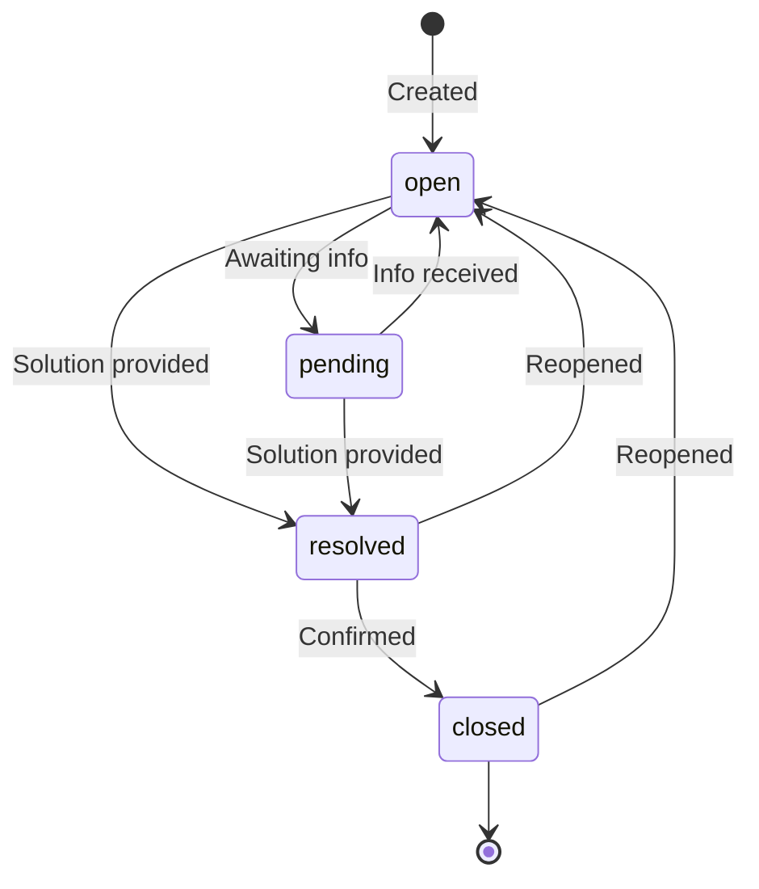

# Tickets Module

> Ticket lifecycle management, messaging, and assignment implementation

---

## Table of Contents

- [Overview](#overview)
- [Directory Structure](#directory-structure)
- [Core Components](#core-components)
- [Ticket Lifecycle](#ticket-lifecycle)
- [Assignment Logic](#assignment-logic)
- [SLA Management](#sla-management)
- [Search & Filtering](#search--filtering)
- [Real-time Updates](#real-time-updates)

---

## Overview

The Tickets module handles:

- Ticket creation and management
- Message threads and internal notes
- Agent assignment and routing
- SLA tracking and enforcement
- Status transitions and workflow
- Search and filtering
- Merge and split operations

---

## Directory Structure

```
modules/tickets/
├── controllers/
│   ├── tickets.controller.ts    # CRUD operations
│   ├── messages.controller.ts   # Ticket messages
│   └── actions.controller.ts    # Assign, resolve, merge
├── services/
│   ├── ticket.service.ts        # Core ticket logic
│   ├── message.service.ts       # Messaging logic
│   ├── assignment.service.ts    # Routing logic
│   ├── sla.service.ts           # SLA tracking
│   └── search.service.ts        # Search functionality
├── repositories/
│   ├── ticket.repository.ts     # Ticket data access
│   └── message.repository.ts    # Message data access
├── validators/
│   ├── ticket.validator.ts      # Ticket schemas
│   └── message.validator.ts     # Message schemas
├── events/
│   └── ticket.events.ts         # Event definitions
├── jobs/
│   ├── sla-check.job.ts         # SLA monitoring
│   └── auto-close.job.ts        # Auto-close resolved
├── types/
│   └── ticket.types.ts          # Type definitions
├── tests/
│   ├── unit/
│   └── integration/
└── index.ts
```

---

## Core Components

### Ticket Service

```typescript
// services/ticket.service.ts
import { Prisma } from '@prisma/client';
import { TicketRepository } from '../repositories/ticket.repository';
import { SlaService } from './sla.service';
import { AssignmentService } from './assignment.service';
import { eventEmitter } from '@/shared/events';

export class TicketService {
  constructor(
    private ticketRepo: TicketRepository,
    private slaService: SlaService,
    private assignmentService: AssignmentService
  ) {}

  async create(data: CreateTicketInput, user: User): Promise<Ticket> {
    // Generate ticket number
    const ticketNumber = await this.generateTicketNumber();

    // Determine SLA policy
    const slaPolicy = await this.slaService.determinePolicy(data, user);
    const slaDue = this.slaService.calculateDueDate(slaPolicy, data.priority);

    // Create ticket
    const ticket = await this.ticketRepo.create({
      ticketNumber,
      subject: data.subject,
      description: data.description,
      status: 'open',
      priority: data.priority || 'medium',
      channel: data.channel || 'web',
      createdById: user.id,
      slaPolicyId: slaPolicy.id,
      slaDueAt: slaDue,
      tags: data.tags || [],
      customFields: data.customFields || {},
    });

    // Create initial message
    if (data.description) {
      await this.messageService.create({
        ticketId: ticket.id,
        senderId: user.id,
        content: data.description,
        isInternal: false,
      });
    }

    // Auto-assign if configured
    const assignment = await this.assignmentService.autoAssign(ticket);
    if (assignment) {
      await this.ticketRepo.update(ticket.id, {
        assignedToId: assignment.agentId,
        teamId: assignment.teamId,
      });
    }

    // Emit event
    eventEmitter.emit('ticket:created', { ticket, user });

    return this.ticketRepo.findById(ticket.id);
  }

  async update(
    ticketId: string,
    data: UpdateTicketInput,
    user: User
  ): Promise<Ticket> {
    const ticket = await this.ticketRepo.findById(ticketId);
    if (!ticket) {
      throw new NotFoundError('Ticket not found');
    }

    // Track changes for activity log
    const changes = this.detectChanges(ticket, data);

    // Update ticket
    const updated = await this.ticketRepo.update(ticketId, {
      ...data,
      updatedAt: new Date(),
    });

    // Log activity
    for (const change of changes) {
      await this.logActivity(ticket.id, change, user);
    }

    // Emit event
    eventEmitter.emit('ticket:updated', {
      ticket: updated,
      changes,
      user,
    });

    return updated;
  }

  async updateStatus(
    ticketId: string,
    status: TicketStatus,
    user: User,
    options?: { resolution?: string }
  ): Promise<Ticket> {
    const ticket = await this.ticketRepo.findById(ticketId);
    
    // Validate status transition
    this.validateStatusTransition(ticket.status, status);

    const updateData: Partial<Ticket> = {
      status,
      updatedAt: new Date(),
    };

    // Handle special status transitions
    switch (status) {
      case 'resolved':
        updateData.resolvedAt = new Date();
        updateData.resolution = options?.resolution;
        break;
      case 'closed':
        updateData.closedAt = new Date();
        break;
      case 'open':
        // Reopen - clear resolution timestamps
        if (ticket.status === 'resolved' || ticket.status === 'closed') {
          updateData.resolvedAt = null;
          updateData.closedAt = null;
        }
        break;
    }

    const updated = await this.ticketRepo.update(ticketId, updateData);

    // Emit event
    eventEmitter.emit('ticket:status_changed', {
      ticket: updated,
      previousStatus: ticket.status,
      user,
    });

    return updated;
  }

  private validateStatusTransition(
    current: TicketStatus,
    next: TicketStatus
  ): void {
    const allowedTransitions: Record<TicketStatus, TicketStatus[]> = {
      open: ['pending', 'resolved', 'closed'],
      pending: ['open', 'resolved', 'closed'],
      resolved: ['open', 'closed'],
      closed: ['open'],
    };

    if (!allowedTransitions[current].includes(next)) {
      throw new ValidationError(
        `Cannot transition from ${current} to ${next}`
      );
    }
  }

  private async generateTicketNumber(): Promise<string> {
    // Atomic increment using Redis
    const counter = await this.redis.incr('ticket:counter');
    return `TKT-${String(counter).padStart(5, '0')}`;
  }

  private detectChanges(
    ticket: Ticket,
    data: Partial<Ticket>
  ): TicketChange[] {
    const changes: TicketChange[] = [];
    const trackedFields = [
      'status',
      'priority',
      'assignedToId',
      'teamId',
      'subject',
    ];

    for (const field of trackedFields) {
      if (data[field] !== undefined && data[field] !== ticket[field]) {
        changes.push({
          field,
          oldValue: ticket[field],
          newValue: data[field],
        });
      }
    }

    return changes;
  }
}
```

### Message Service

```typescript
// services/message.service.ts
export class MessageService {
  constructor(
    private messageRepo: MessageRepository,
    private ticketRepo: TicketRepository
  ) {}

  async create(data: CreateMessageInput, user: User): Promise<Message> {
    const ticket = await this.ticketRepo.findById(data.ticketId);
    if (!ticket) {
      throw new NotFoundError('Ticket not found');
    }

    // Parse markdown to HTML
    const contentHtml = this.parseMarkdown(data.content);

    // Create message
    const message = await this.messageRepo.create({
      ticketId: data.ticketId,
      senderId: user.id,
      content: data.content,
      contentHtml,
      isInternal: data.isInternal || false,
      attachments: data.attachments || [],
    });

    // Update ticket
    await this.ticketRepo.update(ticket.id, {
      lastMessageAt: new Date(),
      messageCount: { increment: 1 },
    });

    // Track first response time for SLA
    const isAgentResponse =
      user.role !== 'user' && !data.isInternal && !ticket.firstResponseAt;

    if (isAgentResponse) {
      await this.ticketRepo.update(ticket.id, {
        firstResponseAt: new Date(),
      });
    }

    // Emit event
    eventEmitter.emit('ticket:message', {
      message,
      ticket,
      isFirstResponse: isAgentResponse,
    });

    return message;
  }

  async list(
    ticketId: string,
    options: ListMessagesOptions,
    user: User
  ): Promise<PaginatedResult<Message>> {
    const ticket = await this.ticketRepo.findById(ticketId);
    
    // Filter internal notes for non-agents
    const includeInternal =
      user.role !== 'user' && options.includeInternal !== false;

    return this.messageRepo.findByTicket(ticketId, {
      ...options,
      isInternal: includeInternal ? undefined : false,
    });
  }

  private parseMarkdown(content: string): string {
    // Sanitize and parse markdown
    const html = marked.parse(content);
    return DOMPurify.sanitize(html, {
      ALLOWED_TAGS: [
        'p', 'br', 'strong', 'em', 'u', 's', 'a', 'ul', 'ol', 'li',
        'code', 'pre', 'blockquote', 'img', 'h1', 'h2', 'h3',
      ],
      ALLOWED_ATTR: ['href', 'src', 'alt', 'title', 'class'],
    });
  }
}
```

---

## Ticket Lifecycle

### Status Flow



### Lifecycle Events

| Event | Trigger | Actions |
|-------|---------|---------|
| `ticket:created` | New ticket | Notify team, start SLA |
| `ticket:assigned` | Agent assigned | Notify agent |
| `ticket:message` | New message | Update timestamps, notify |
| `ticket:status_changed` | Status update | Log activity, notify |
| `ticket:sla:warning` | 80% SLA time | Escalate, notify |
| `ticket:sla:breached` | SLA deadline | Escalate, log |
| `ticket:resolved` | Marked resolved | Send survey, stop SLA |
| `ticket:closed` | Closed | Archive, analytics |

---

## Assignment Logic

### Assignment Service

```typescript
// services/assignment.service.ts
export class AssignmentService {
  async autoAssign(ticket: Ticket): Promise<Assignment | null> {
    // Get assignment rules ordered by priority
    const rules = await this.getAssignmentRules();

    for (const rule of rules) {
      if (this.matchesRule(ticket, rule)) {
        return this.applyRule(ticket, rule);
      }
    }

    // Default: round-robin to team
    return this.roundRobinAssign(ticket);
  }

  async manualAssign(
    ticketId: string,
    agentId: string,
    user: User
  ): Promise<Ticket> {
    const ticket = await this.ticketRepo.findById(ticketId);
    const agent = await this.userRepo.findById(agentId);

    if (!agent || agent.role === 'user') {
      throw new ValidationError('Invalid agent');
    }

    // Check agent workload
    const workload = await this.getAgentWorkload(agentId);
    if (workload.current >= workload.max) {
      throw new ValidationError('Agent at capacity');
    }

    const previousAssignee = ticket.assignedToId;

    await this.ticketRepo.update(ticketId, {
      assignedToId: agentId,
      teamId: agent.teamId,
    });

    // Emit event
    eventEmitter.emit('ticket:assigned', {
      ticket,
      agentId,
      previousAssignee,
      assignedBy: user,
    });

    return this.ticketRepo.findById(ticketId);
  }

  private async roundRobinAssign(ticket: Ticket): Promise<Assignment | null> {
    // Get available agents in default team
    const team = await this.getDefaultTeam();
    const agents = await this.getAvailableAgents(team.id);

    if (agents.length === 0) {
      return { teamId: team.id, agentId: null };
    }

    // Get last assigned agent from cache
    const lastAssigned = await this.redis.get(`roundrobin:${team.id}`);
    const lastIndex = lastAssigned
      ? agents.findIndex((a) => a.id === lastAssigned)
      : -1;

    // Next agent in rotation
    const nextIndex = (lastIndex + 1) % agents.length;
    const agent = agents[nextIndex];

    // Update cache
    await this.redis.set(`roundrobin:${team.id}`, agent.id);

    return {
      teamId: team.id,
      agentId: agent.id,
    };
  }

  private async getAvailableAgents(teamId: string): Promise<Agent[]> {
    const agents = await this.userRepo.findByTeam(teamId);

    // Filter by availability
    return agents.filter((agent) => {
      const status = this.presenceService.getStatus(agent.id);
      return status === 'online' || status === 'busy';
    });
  }
}
```

### Assignment Rules

```typescript
interface AssignmentRule {
  id: string;
  name: string;
  priority: number;
  conditions: Condition[];
  action: {
    type: 'assign_agent' | 'assign_team' | 'round_robin';
    agentId?: string;
    teamId?: string;
  };
}

// Example rules
const rules: AssignmentRule[] = [
  {
    id: 'rule_vip',
    name: 'VIP Customers',
    priority: 1,
    conditions: [
      { field: 'customer.tier', operator: 'equals', value: 'vip' },
    ],
    action: { type: 'assign_team', teamId: 'team_vip' },
  },
  {
    id: 'rule_billing',
    name: 'Billing Issues',
    priority: 2,
    conditions: [
      { field: 'tags', operator: 'contains', value: 'billing' },
    ],
    action: { type: 'assign_team', teamId: 'team_billing' },
  },
  {
    id: 'rule_urgent',
    name: 'Urgent Priority',
    priority: 3,
    conditions: [
      { field: 'priority', operator: 'equals', value: 'urgent' },
    ],
    action: { type: 'assign_team', teamId: 'team_senior' },
  },
];
```

---

## SLA Management

### SLA Service

```typescript
// services/sla.service.ts
export class SlaService {
  constructor(
    private slaPolicyRepo: SlaPolicyRepository,
    private ticketRepo: TicketRepository
  ) {}

  async determinePolicy(ticket: Ticket, customer: User): Promise<SlaPolicy> {
    // Get policies ordered by priority
    const policies = await this.slaPolicyRepo.findAllActive();

    for (const policy of policies) {
      if (this.matchesConditions(ticket, customer, policy.conditions)) {
        return policy;
      }
    }

    // Return default policy
    return this.slaPolicyRepo.findDefault();
  }

  calculateDueDate(
    policy: SlaPolicy,
    priority: Priority
  ): Date {
    const targetMinutes = policy.targets.firstResponse[priority];
    
    if (policy.businessHours.enabled) {
      return this.addBusinessMinutes(new Date(), targetMinutes, policy);
    }

    return new Date(Date.now() + targetMinutes * 60 * 1000);
  }

  async checkSlaStatus(ticketId: string): Promise<SlaStatus> {
    const ticket = await this.ticketRepo.findById(ticketId);

    if (!ticket.slaDueAt) {
      return { status: 'no_sla' };
    }

    if (ticket.firstResponseAt) {
      const metSla = ticket.firstResponseAt <= ticket.slaDueAt;
      return { status: metSla ? 'met' : 'breached' };
    }

    const now = new Date();
    const remaining = ticket.slaDueAt.getTime() - now.getTime();
    const total = ticket.slaDueAt.getTime() - ticket.createdAt.getTime();
    const percentRemaining = (remaining / total) * 100;

    if (now >= ticket.slaDueAt) {
      return { status: 'breached', breachedAt: ticket.slaDueAt };
    }

    if (percentRemaining <= 20) {
      return {
        status: 'warning',
        minutesRemaining: Math.floor(remaining / 60000),
        percentRemaining,
      };
    }

    return {
      status: 'on_track',
      minutesRemaining: Math.floor(remaining / 60000),
      percentRemaining,
    };
  }

  private addBusinessMinutes(
    start: Date,
    minutes: number,
    policy: SlaPolicy
  ): Date {
    const schedule = policy.businessHours.schedule;
    let remaining = minutes;
    let current = new Date(start);

    while (remaining > 0) {
      const daySchedule = schedule[current.getDay()];

      if (daySchedule && this.isBusinessHour(current, daySchedule)) {
        remaining--;
        current = new Date(current.getTime() + 60000);
      } else {
        // Skip to next business hour
        current = this.nextBusinessHour(current, schedule);
      }
    }

    return current;
  }
}
```

### SLA Check Job

```typescript
// jobs/sla-check.job.ts
export const slaCheckJob = new Queue('sla-check', {
  connection: redis,
});

// Processor
slaCheckJob.process(async () => {
  // Find tickets approaching SLA
  const warningTickets = await prisma.ticket.findMany({
    where: {
      status: { in: ['open', 'pending'] },
      firstResponseAt: null,
      slaDueAt: {
        lte: new Date(Date.now() + 30 * 60 * 1000), // 30 min
        gt: new Date(),
      },
      slaWarningNotified: false,
    },
  });

  for (const ticket of warningTickets) {
    eventEmitter.emit('ticket:sla:warning', {
      ticket,
      minutesRemaining: Math.floor(
        (ticket.slaDueAt.getTime() - Date.now()) / 60000
      ),
    });

    await prisma.ticket.update({
      where: { id: ticket.id },
      data: { slaWarningNotified: true },
    });
  }

  // Find breached tickets
  const breachedTickets = await prisma.ticket.findMany({
    where: {
      status: { in: ['open', 'pending'] },
      firstResponseAt: null,
      slaDueAt: { lte: new Date() },
      slaBreached: false,
    },
  });

  for (const ticket of breachedTickets) {
    eventEmitter.emit('ticket:sla:breached', { ticket });

    await prisma.ticket.update({
      where: { id: ticket.id },
      data: { slaBreached: true },
    });
  }
});

// Schedule to run every minute
slaCheckJob.add('check', {}, { repeat: { cron: '* * * * *' } });
```

---

## Search & Filtering

### Search Service

```typescript
// services/search.service.ts
export class SearchService {
  async search(
    query: SearchQuery,
    user: User
  ): Promise<PaginatedResult<Ticket>> {
    const filters: Prisma.TicketWhereInput = {};

    // Text search
    if (query.q) {
      filters.OR = [
        { subject: { contains: query.q, mode: 'insensitive' } },
        { description: { contains: query.q, mode: 'insensitive' } },
        { ticketNumber: { contains: query.q, mode: 'insensitive' } },
      ];
    }

    // Status filter
    if (query.status) {
      filters.status = Array.isArray(query.status)
        ? { in: query.status }
        : query.status;
    }

    // Priority filter
    if (query.priority) {
      filters.priority = Array.isArray(query.priority)
        ? { in: query.priority }
        : query.priority;
    }

    // Assignment filter
    if (query.assignedTo === 'me') {
      filters.assignedToId = user.id;
    } else if (query.assignedTo === 'unassigned') {
      filters.assignedToId = null;
    } else if (query.assignedTo) {
      filters.assignedToId = query.assignedTo;
    }

    // Team filter
    if (query.teamId) {
      filters.teamId = query.teamId;
    }

    // Date range
    if (query.createdAt) {
      filters.createdAt = {};
      if (query.createdAt.gte) {
        filters.createdAt.gte = new Date(query.createdAt.gte);
      }
      if (query.createdAt.lte) {
        filters.createdAt.lte = new Date(query.createdAt.lte);
      }
    }

    // SLA filter
    if (query.slaBreached !== undefined) {
      filters.slaBreached = query.slaBreached;
    }

    // Access control
    if (user.role === 'user') {
      filters.createdById = user.id;
    } else if (user.role === 'agent') {
      filters.OR = [
        { assignedToId: user.id },
        { teamId: user.teamId },
        { createdById: user.id },
      ];
    }

    // Parse sort
    const orderBy = this.parseSort(query.sort);

    return this.ticketRepo.findMany({
      where: filters,
      orderBy,
      page: query.page,
      perPage: query.perPage,
    });
  }

  private parseSort(sort?: string): Prisma.TicketOrderByWithRelationInput[] {
    if (!sort) {
      return [{ createdAt: 'desc' }];
    }

    const orders: Prisma.TicketOrderByWithRelationInput[] = [];

    for (const field of sort.split(',')) {
      const desc = field.startsWith('-');
      const name = desc ? field.slice(1) : field;
      orders.push({ [name]: desc ? 'desc' : 'asc' });
    }

    return orders;
  }
}
```

---

## Real-time Updates

### Event Handlers

```typescript
// events/ticket.events.ts
import { io } from '@/shared/socket';

eventEmitter.on('ticket:created', async ({ ticket }) => {
  // Notify assigned team
  if (ticket.teamId) {
    io.to(`team:${ticket.teamId}`).emit('ticket:created', ticket);
  }

  // Notify admins
  io.to('role:admin').emit('ticket:created', ticket);
});

eventEmitter.on('ticket:message', async ({ message, ticket }) => {
  // Notify ticket subscribers
  io.to(`ticket:${ticket.id}`).emit('ticket:message', message);

  // Notify assigned agent if message from customer
  if (ticket.assignedToId && message.senderId !== ticket.assignedToId) {
    io.to(`user:${ticket.assignedToId}`).emit('ticket:message', message);
  }
});

eventEmitter.on('ticket:assigned', async ({ ticket, agentId }) => {
  // Notify new assignee
  io.to(`user:${agentId}`).emit('ticket:assigned', ticket);
});

eventEmitter.on('ticket:sla:warning', async ({ ticket, minutesRemaining }) => {
  // Notify assignee
  if (ticket.assignedToId) {
    io.to(`user:${ticket.assignedToId}`).emit('ticket:sla:warning', {
      ticket,
      minutesRemaining,
    });
  }

  // Notify team lead
  if (ticket.teamId) {
    io.to(`team:${ticket.teamId}:leads`).emit('ticket:sla:warning', {
      ticket,
      minutesRemaining,
    });
  }
});
```

---

## Related Documents

- [Tickets API](../../03-api/tickets.md) — API endpoint documentation
- [Database Schema](../../02-database/schema.md) — Ticket data model
- [Real-time Module](../realtime/overview.md) — WebSocket implementation

---

*Next: [Real-time Module →](../realtime/overview.md)*
