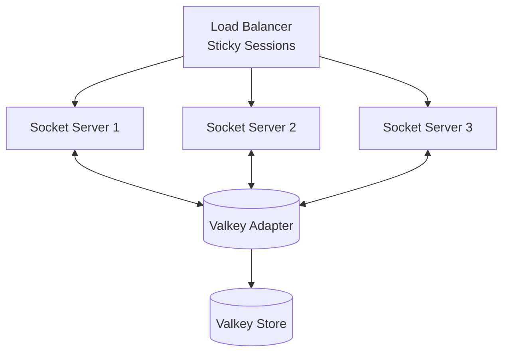

# Real-time Module

> WebSocket implementation for live updates, presence, and notifications

---

## Table of Contents

- [Overview](#overview)
- [Directory Structure](#directory-structure)
- [Socket.IO Setup](#socketio-setup)
- [Namespace Handlers](#namespace-handlers)
- [Valkey Adapter](#valkey-adapter)
- [Presence System](#presence-system)
- [Rate Limiting](#rate-limiting)
- [Scaling Strategy](#scaling-strategy)

---

## Overview

The Real-time module provides:

- WebSocket connections via Socket.IO
- Live ticket updates and notifications
- Agent presence and status tracking
- Typing indicators
- Live chat functionality
- Dashboard real-time metrics

---

## Directory Structure

```
modules/realtime/
├── server/
│   ├── index.ts                 # Socket.IO server setup
│   ├── middleware/
│   │   ├── auth.middleware.ts   # Socket authentication
│   │   └── rate-limit.ts        # Socket rate limiting
│   └── namespaces/
│       ├── tickets.namespace.ts
│       ├── chat.namespace.ts
│       ├── notifications.namespace.ts
│       ├── presence.namespace.ts
│       └── dashboard.namespace.ts
├── services/
│   ├── socket.service.ts        # Socket operations
│   ├── presence.service.ts      # Presence tracking
│   └── room.service.ts          # Room management
├── adapters/
│   └── valkey.adapter.ts        # Valkey pub/sub adapter
├── events/
│   └── socket.events.ts         # Event handlers
├── types/
│   └── socket.types.ts          # Socket types
├── tests/
│   ├── unit/
│   └── integration/
└── index.ts
```

---

## Socket.IO Setup

### Server Initialization

```typescript
// server/index.ts
import { Server as HttpServer } from 'http';
import { Server, Socket } from 'socket.io';
import { createAdapter } from '@socket.io/valkey-adapter';
import { createClient } from 'ioredis';
import { authMiddleware } from './middleware/auth.middleware';
import { rateLimitMiddleware } from './middleware/rate-limit';
import { setupNamespaces } from './namespaces';

export async function initializeSocketServer(
  httpServer: HttpServer
): Promise<Server> {
  // Create Socket.IO server
  const io = new Server(httpServer, {
    path: '/socket.io',
    cors: {
      origin: config.cors.origins,
      credentials: true,
    },
    transports: ['websocket', 'polling'],
    pingTimeout: 30000,
    pingInterval: 25000,
    maxHttpBufferSize: 1e6, // 1MB
  });

  // Setup Valkey adapter for horizontal scaling
  const pubClient = createClient({ url: config.valkey.url });
  const subClient = pubClient.duplicate();

  await Promise.all([pubClient.connect(), subClient.connect()]);

  io.adapter(createAdapter(pubClient, subClient, {
    key: 'insightdesk:socket',
    requestsTimeout: 5000,
  }));

  // Setup namespaces
  setupNamespaces(io);

  // Global middleware
  io.use(authMiddleware);
  io.use(rateLimitMiddleware);

  // Connection handling
  io.on('connection', (socket: Socket) => {
    logger.info('Socket connected', {
      socketId: socket.id,
      userId: socket.data.user?.id,
    });

    // Join user-specific room
    if (socket.data.user) {
      socket.join(`user:${socket.data.user.id}`);
      
      // Join role room
      socket.join(`role:${socket.data.user.role}`);
      
      // Join team room
      if (socket.data.user.teamId) {
        socket.join(`team:${socket.data.user.teamId}`);
      }
    }

    socket.on('disconnect', (reason) => {
      logger.info('Socket disconnected', {
        socketId: socket.id,
        reason,
      });
    });
  });

  return io;
}
```

### Authentication Middleware

```typescript
// server/middleware/auth.middleware.ts
import { Socket } from 'socket.io';
import { ExtendedError } from 'socket.io/dist/namespace';
import { TokenService } from '@/modules/auth/services/token.service';

export function authMiddleware(
  socket: Socket,
  next: (err?: ExtendedError) => void
) {
  const token = socket.handshake.auth.token;

  if (!token) {
    return next(new Error('AUTH_TOKEN_MISSING'));
  }

  try {
    const payload = tokenService.verifyAccessToken(token);
    
    // Attach user to socket
    socket.data.user = {
      id: payload.sub,
      email: payload.email,
      role: payload.role,
      sessionId: payload.sessionId,
    };

    next();
  } catch (error) {
    if (error.code === 'TOKEN_EXPIRED') {
      return next(new Error('AUTH_TOKEN_EXPIRED'));
    }
    return next(new Error('AUTH_TOKEN_INVALID'));
  }
}
```

---

## Namespace Handlers

### Tickets Namespace

```typescript
// server/namespaces/tickets.namespace.ts
import { Namespace, Socket } from 'socket.io';

export function setupTicketsNamespace(io: Server): void {
  const nsp = io.of('/tickets');

  nsp.on('connection', (socket: Socket) => {
    const user = socket.data.user;

    // Subscribe to ticket updates
    socket.on('ticket:subscribe', async ({ ticketId }) => {
      // Verify access
      const canAccess = await ticketService.canAccess(user.id, ticketId);
      if (!canAccess) {
        return socket.emit('error', { code: 'FORBIDDEN' });
      }

      socket.join(`ticket:${ticketId}`);
      socket.emit('ticket:subscribed', { ticketId });

      logger.debug('Subscribed to ticket', {
        userId: user.id,
        ticketId,
      });
    });

    // Unsubscribe
    socket.on('ticket:unsubscribe', ({ ticketId }) => {
      socket.leave(`ticket:${ticketId}`);
      socket.emit('ticket:unsubscribed', { ticketId });
    });

    // Typing indicator
    socket.on('ticket:typing', ({ ticketId }) => {
      socket.to(`ticket:${ticketId}`).emit('ticket:typing', {
        ticketId,
        user: {
          id: user.id,
          name: user.name,
        },
      });

      // Auto-stop typing after 5 seconds
      clearTimeout(socket.data.typingTimeout);
      socket.data.typingTimeout = setTimeout(() => {
        socket.to(`ticket:${ticketId}`).emit('ticket:stopTyping', {
          ticketId,
          userId: user.id,
        });
      }, 5000);
    });

    socket.on('ticket:stopTyping', ({ ticketId }) => {
      clearTimeout(socket.data.typingTimeout);
      socket.to(`ticket:${ticketId}`).emit('ticket:stopTyping', {
        ticketId,
        userId: user.id,
      });
    });
  });
}
```

### Presence Namespace

```typescript
// server/namespaces/presence.namespace.ts
export function setupPresenceNamespace(io: Server): void {
  const nsp = io.of('/presence');

  nsp.on('connection', async (socket: Socket) => {
    const user = socket.data.user;

    // Set initial presence
    await presenceService.setOnline(user.id, socket.id);

    // Join user room
    socket.join(`user:${user.id}`);

    // Broadcast status to team
    if (user.teamId) {
      nsp.to(`team:${user.teamId}`).emit('presence:update', {
        userId: user.id,
        status: 'online',
      });
    }

    // Status change
    socket.on('presence:status', async ({ status }) => {
      const validStatuses = ['online', 'busy', 'away'];
      if (!validStatuses.includes(status)) {
        return socket.emit('error', { code: 'INVALID_STATUS' });
      }

      await presenceService.setStatus(user.id, status);

      // Broadcast to team
      if (user.teamId) {
        nsp.to(`team:${user.teamId}`).emit('presence:update', {
          userId: user.id,
          status,
        });
      }
    });

    // Subscribe to users
    socket.on('presence:subscribe', async ({ userIds }) => {
      // Get current status of users
      const statuses = await presenceService.getStatuses(userIds);
      socket.emit('presence:list', statuses);

      // Join rooms for updates
      for (const userId of userIds) {
        socket.join(`presence:${userId}`);
      }
    });

    socket.on('presence:unsubscribe', ({ userIds }) => {
      for (const userId of userIds) {
        socket.leave(`presence:${userId}`);
      }
    });

    // Handle disconnect
    socket.on('disconnect', async () => {
      // Check if user has other connections
      const sockets = await nsp.in(`user:${user.id}`).fetchSockets();
      
      if (sockets.length === 0) {
        await presenceService.setOffline(user.id);

        if (user.teamId) {
          nsp.to(`team:${user.teamId}`).emit('presence:update', {
            userId: user.id,
            status: 'offline',
            lastSeen: new Date().toISOString(),
          });
        }
      }
    });
  });
}
```

### Notifications Namespace

```typescript
// server/namespaces/notifications.namespace.ts
export function setupNotificationsNamespace(io: Server): void {
  const nsp = io.of('/notifications');

  nsp.on('connection', async (socket: Socket) => {
    const user = socket.data.user;

    // Join user room
    socket.join(`user:${user.id}`);

    // Get unread count
    const unreadCount = await notificationService.getUnreadCount(user.id);
    socket.emit('notification:count', { unread: unreadCount });

    // Mark notification as read
    socket.on('notification:markRead', async ({ id }) => {
      await notificationService.markRead(id, user.id);
      const newCount = await notificationService.getUnreadCount(user.id);
      socket.emit('notification:count', { unread: newCount });
    });

    // Mark all as read
    socket.on('notification:markAllRead', async () => {
      await notificationService.markAllRead(user.id);
      socket.emit('notification:count', { unread: 0 });
    });
  });
}

// Send notification to user
export async function sendNotification(
  userId: string,
  notification: Notification
): Promise<void> {
  const nsp = io.of('/notifications');
  nsp.to(`user:${userId}`).emit('notification', notification);
}
```

### Dashboard Namespace

```typescript
// server/namespaces/dashboard.namespace.ts
export function setupDashboardNamespace(io: Server): void {
  const nsp = io.of('/dashboard');

  // Admin-only namespace
  nsp.use((socket, next) => {
    if (socket.data.user?.role !== 'admin') {
      return next(new Error('FORBIDDEN'));
    }
    next();
  });

  nsp.on('connection', (socket: Socket) => {
    // Join dashboard room
    socket.join('dashboard');

    // Send initial metrics
    sendDashboardMetrics(socket);
  });

  // Broadcast metrics every 5 seconds
  setInterval(async () => {
    const metrics = await dashboardService.getLiveMetrics();
    nsp.to('dashboard').emit('metrics:tickets', metrics.tickets);
    nsp.to('dashboard').emit('metrics:queue', metrics.queue);
    nsp.to('dashboard').emit('metrics:agents', metrics.agents);
  }, 5000);
}

async function sendDashboardMetrics(socket: Socket): Promise<void> {
  const metrics = await dashboardService.getLiveMetrics();
  socket.emit('metrics:tickets', metrics.tickets);
  socket.emit('metrics:queue', metrics.queue);
  socket.emit('metrics:agents', metrics.agents);
}
```

---

## Valkey Adapter

### Custom Adapter Configuration

```typescript
// adapters/valkey.adapter.ts
import { createAdapter } from '@socket.io/valkey-adapter';
import { Redis } from 'ioredis';

export async function createValkeyAdapter() {
  const pubClient = new Redis(config.valkey.url, {
    // Connection settings
    maxRetriesPerRequest: 3,
    enableReadyCheck: true,
    
    // Retry strategy
    retryStrategy(times) {
      const delay = Math.min(times * 50, 2000);
      return delay;
    },
  });

  const subClient = pubClient.duplicate();

  // Error handling
  pubClient.on('error', (err) => {
    logger.error('Valkey pub client error', err);
  });

  subClient.on('error', (err) => {
    logger.error('Valkey sub client error', err);
  });

  // Wait for connections
  await Promise.all([
    new Promise((resolve) => pubClient.once('ready', resolve)),
    new Promise((resolve) => subClient.once('ready', resolve)),
  ]);

  return createAdapter(pubClient, subClient, {
    key: 'socket.io',
    requestsTimeout: 5000,
  });
}
```

---

## Presence System

### Presence Service

```typescript
// services/presence.service.ts
export class PresenceService {
  private readonly keyPrefix = 'presence:';
  private readonly ttl = 60; // seconds

  constructor(private redis: Redis) {}

  async setOnline(userId: string, socketId: string): Promise<void> {
    const key = `${this.keyPrefix}${userId}`;
    
    await this.redis
      .multi()
      .hset(key, {
        status: 'online',
        socketId,
        lastSeen: Date.now().toString(),
      })
      .expire(key, this.ttl)
      .exec();

    // Start heartbeat
    this.startHeartbeat(userId);
  }

  async setStatus(userId: string, status: string): Promise<void> {
    const key = `${this.keyPrefix}${userId}`;
    await this.redis.hset(key, 'status', status);
  }

  async setOffline(userId: string): Promise<void> {
    const key = `${this.keyPrefix}${userId}`;
    await this.redis.hset(key, {
      status: 'offline',
      lastSeen: Date.now().toString(),
    });
  }

  async getStatus(userId: string): Promise<PresenceStatus> {
    const key = `${this.keyPrefix}${userId}`;
    const data = await this.redis.hgetall(key);

    if (!data || Object.keys(data).length === 0) {
      return { status: 'offline' };
    }

    return {
      status: data.status as string,
      lastSeen: data.lastSeen ? new Date(parseInt(data.lastSeen)) : undefined,
    };
  }

  async getStatuses(userIds: string[]): Promise<PresenceStatus[]> {
    const pipeline = this.redis.pipeline();

    for (const userId of userIds) {
      pipeline.hgetall(`${this.keyPrefix}${userId}`);
    }

    const results = await pipeline.exec();

    return results.map(([err, data], index) => {
      if (err || !data || Object.keys(data).length === 0) {
        return { userId: userIds[index], status: 'offline' };
      }

      return {
        userId: userIds[index],
        status: data.status,
        lastSeen: data.lastSeen ? new Date(parseInt(data.lastSeen)) : undefined,
      };
    });
  }

  private startHeartbeat(userId: string): void {
    const interval = setInterval(async () => {
      const key = `${this.keyPrefix}${userId}`;
      const exists = await this.redis.exists(key);

      if (exists) {
        await this.redis.expire(key, this.ttl);
      } else {
        clearInterval(interval);
      }
    }, (this.ttl / 2) * 1000);
  }
}
```

---

## Rate Limiting

### Socket Rate Limiter

```typescript
// server/middleware/rate-limit.ts
import { Socket } from 'socket.io';

const eventLimits = {
  'ticket:typing': { max: 10, window: 10 }, // 10 per 10 seconds
  'chat:message': { max: 5, window: 1 },    // 5 per second
  'presence:status': { max: 5, window: 60 }, // 5 per minute
  default: { max: 100, window: 60 },         // 100 per minute
};

export function rateLimitMiddleware(
  socket: Socket,
  next: () => void
) {
  const originalEmit = socket.emit.bind(socket);
  const counters = new Map<string, { count: number; resetAt: number }>();

  socket.onAny((event: string) => {
    const limit = eventLimits[event] || eventLimits.default;
    const key = `${socket.id}:${event}`;
    const now = Date.now();

    let counter = counters.get(key);

    if (!counter || now > counter.resetAt) {
      counter = { count: 0, resetAt: now + limit.window * 1000 };
      counters.set(key, counter);
    }

    counter.count++;

    if (counter.count > limit.max) {
      socket.emit('error', {
        code: 'RATE_LIMITED',
        message: `Too many ${event} events`,
        retryAfter: Math.ceil((counter.resetAt - now) / 1000),
      });
      return false;
    }

    return true;
  });

  next();
}
```

---

## Scaling Strategy

### Multi-Server Setup



### Sticky Sessions

Nginx configuration:

```nginx
upstream socket_servers {
    ip_hash;  # Sticky sessions
    server socket1:3001;
    server socket2:3001;
    server socket3:3001;
}

server {
    location /socket.io/ {
        proxy_pass http://socket_servers;
        proxy_http_version 1.1;
        proxy_set_header Upgrade $http_upgrade;
        proxy_set_header Connection "upgrade";
        proxy_set_header Host $host;
        proxy_set_header X-Real-IP $remote_addr;
        proxy_set_header X-Forwarded-For $proxy_add_x_forwarded_for;
        proxy_read_timeout 86400;
    }
}
```

### Broadcasting Across Servers

```typescript
// Broadcast to all servers via Valkey adapter
io.to(`ticket:${ticketId}`).emit('ticket:updated', data);

// Server-specific operations
const sockets = await io.in(`ticket:${ticketId}`).fetchSockets();
for (const socket of sockets) {
  // Access socket data across servers
  console.log(socket.data.user);
}

// Count connections across all servers
const count = await io.of('/').adapter.serverCount();
```

---

## Related Documents

- [WebSockets API](../../03-api/websockets.md) — Client documentation
- [Infrastructure](../../01-architecture/infrastructure.md) — Deployment
- [Scalability](../../01-architecture/scalability.md) — Scaling patterns

---

*Next: [Knowledge Base Module →](../knowledge-base/overview.md)*
